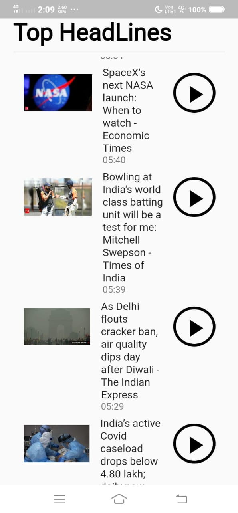
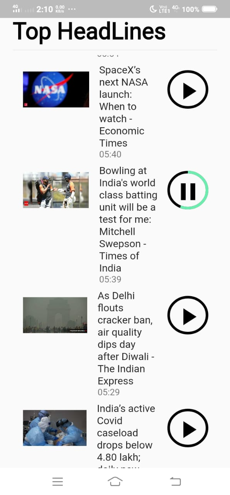

# NewsAudioBook 
 <span></span>
 <span></span>
[App Download Link](https://drive.google.com/file/d/1bQem6ope72Jod8TzzkcrxzcN-muIj1df/view?usp=drivesdk)
## Not ready for production yet 👍
## OverView
> Many people like to listen the news rather than reading. People while driving or doing some other task can also get the new by listining rather than reading so here come `NewsAudioBook` in action you can listen news jsut by tapping on the play button and this app will read news for you.

## TechStack
- [Flutter](https://flutter.dev/) for making this app
- [News Api](https://newsapi.org/s/india-news-api) for getting the recent news
- [Google Text To Speech Api](https://cloud.google.com/text-to-speech) for converting the news text to speech.

## Working
> From `news.dart` file we make a `http` request to news `api` to get the data in the json format.
> Then after from `voice_connection.dart` file we make a `post` request to `text-to-speech-api` that seems like.
```json
{
  "audioConfig": {
    "audioEncoding": "LINEAR16",
    "pitch": 0,
    "speakingRate": 1
  },
  "input": {
    "text": text
  },
  "voice": {
    "languageCode": "en-US",
    "name": "en-US-Wavenet-D"
  }
}
```
> Then `text-to-sppech` api return a `Base64` encoded audio string. Then we decode this Base64 audio to mp3 and serve to the user via `player.dart` file

A few resources to get you started if this is your first Flutter project:

- [Lab: Write your first Flutter app](https://flutter.dev/docs/get-started/codelab)
- [Cookbook: Useful Flutter samples](https://flutter.dev/docs/cookbook)

For help getting started with Flutter, view our
[online documentation](https://flutter.dev/docs), which offers tutorials,
samples, guidance on mobile development, and a full API reference.
